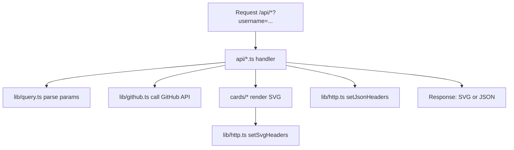

# gh-stats

📖 **Overview**

`gh-stats` is a minimal, dependency-light Vercel serverless service that generates **SVG cards** (or JSON) you can embed directly into your GitHub profile README. It’s designed to be easy to self-host, fast to render, and simple to understand/modify.

It currently ships four “cards”:

- 📊 **Stats** (repos, followers, total stars, total forks)
- 🧠 **Languages** (top languages across recent public repos, by bytes)
- 📦 **Repos** (top repos by stars/forks/updated)
- 🔥 **Streak** (contribution streak via GitHub GraphQL; token required)

✨ **Features**

- 🖼️ SVG-first output (ideal for GitHub README embeds)
- 🧾 Optional `format=json` for debugging / integrations
- 🎨 `dark`/`light` themes
- ⚡ Vercel-friendly: `/api/*` serverless functions with Node 20 runtime
- 🧰 No runtime deps (only `typescript` + `@types/node` as dev deps)
- 🗄️ Built-in caching headers (Edge/CDN cache via `s-maxage`)

✅ **Requirements**

- Node.js `>= 20` (see `package.json`)
- (Recommended) Vercel CLI for local dev: `npm i -g vercel`
- (Recommended) GitHub token for higher rate limits: `GITHUB_TOKEN` or `GH_TOKEN`

🚀 **Installation**

```bash
npm install
```

🛠️ **Usage**

Local dev (Vercel dev server):

```bash
vercel dev
```

Then hit endpoints like:

- `http://localhost:3000/api/health`
- `http://localhost:3000/api/stats?username=octocat&theme=dark`

Deploy:

```bash
vercel
```

📦 **Technologies**

- TypeScript (ESNext modules)
- Vercel Serverless Functions (Node.js 20 runtime via `vercel.json`)
- GitHub REST API + GitHub GraphQL API (for streak)

🔧 **Configuration**

Environment variables:

- `GITHUB_TOKEN` (preferred) or `GH_TOKEN`
  - Enables `/api/streak` (GraphQL requires auth)
  - Improves REST rate limits for `/api/stats`, `/api/repos`, `/api/languages`

Vercel setup:

- Project Settings → Environment Variables → add `GITHUB_TOKEN`
- `vercel.json` pins function runtime to `nodejs20.x` for `api/**/*.ts`

## 🚏 Endpoints

### `/api/health`

Health check.

- Example: `/api/health`
- Output: JSON only

### `/api/stats`

Generates a “GitHub Stats” card by combining:

- GitHub user profile (`GET /users/:username`)
- Public repos list (`GET /users/:username/repos?per_page=100&sort=updated`)

It totals:

- `stars`: sum of `stargazers_count` across returned repos
- `forks`: sum of `forks_count` across returned repos

Examples:

- `/api/stats?username=octocat&theme=dark`
- `/api/stats?username=octocat&format=json`

### `/api/repos`

Generates a “Top Repositories” card from public repos, filtering out forks and archived repos, then sorting.

Query params:

- `count` (default `6`, range `1..10`)
- `sort` = `stars|forks|updated` (default `stars`)

Examples:

- `/api/repos?username=octocat&theme=dark&count=6&sort=stars`
- `/api/repos?username=octocat&format=json&sort=updated`

### `/api/languages`

Generates a “Top Languages” card by:

1) Listing repos
2) Taking up to 30 non-fork, non-archived repos (rate-limit friendly cap)
3) Fetching `GET /repos/:owner/:repo/languages` for each
4) Summing bytes per language and sorting desc

Examples:

- `/api/languages?username=octocat&theme=dark`
- `/api/languages?username=octocat&format=json`

Note: without a token, this endpoint is the most likely to hit rate limits because it does multiple GitHub API requests.

### `/api/streak`

Generates a “Contribution Streak” card using GitHub GraphQL `contributionCalendar` for the last 365 days.

Requires:

- `GITHUB_TOKEN` (or `GH_TOKEN`) set in env vars

Examples:

- `/api/streak?username=octocat&theme=dark`
- `/api/streak?username=octocat&format=json`

## 🔌 Common Query Params

Shared across most endpoints:

- `username` (required)
- `theme` = `dark|light` (default: `dark`)
- `format` = `svg|json` (default: `svg`)

## 🧩 Embed Examples (GitHub README)

Use a `<picture>` tag for automatic theme switching:

```html
<picture>
  <source srcset="https://YOUR.vercel.app/api/stats?username=YOUR_USER&theme=dark" media="(prefers-color-scheme: dark)">
  
</picture>
```

You can do the same for the other cards:

- Languages:
  - Dark: `https://YOUR.vercel.app/api/languages?username=YOUR_USER&theme=dark`
  - Light: `https://YOUR.vercel.app/api/languages?username=YOUR_USER&theme=light`
- Repos:
  - Dark: `https://YOUR.vercel.app/api/repos?username=YOUR_USER&theme=dark&count=6&sort=stars`
  - Light: `https://YOUR.vercel.app/api/repos?username=YOUR_USER&theme=light&count=6&sort=stars`
- Streak (token required):
  - Dark: `https://YOUR.vercel.app/api/streak?username=YOUR_USER&theme=dark`
  - Light: `https://YOUR.vercel.app/api/streak?username=YOUR_USER&theme=light`

## 🗂️ Repository Structure

Complete tree (current workspace):

```text
.
├── .gitignore
├── README.md
├── README_bak.md
├── api
│   ├── health.ts
│   ├── languages.ts
│   ├── repos.ts
│   ├── stats.ts
│   └── streak.ts
├── cards
│   ├── languages.ts
│   ├── repos.ts
│   ├── stats.ts
│   ├── streak.ts
│   └── svg.ts
├── lib
│   ├── github.ts
│   ├── http.ts
│   ├── query.ts
│   └── streak.ts
├── package.json
├── tsconfig.json
└── vercel.json
```

What each folder does:

- `api/`: Vercel serverless entrypoints (one file per endpoint). Each handler:
  - Parses query params (`lib/query.ts`)
  - Calls GitHub API helpers (`lib/github.ts`)
  - Renders SVG via card renderers (`cards/*`)
  - Returns either SVG or JSON depending on `format`
- `cards/`: Pure render logic (string-based SVG composition).
  - `cards/svg.ts` provides shared primitives like `cardFrame`, text, chips, bars, and XML escaping.
- `lib/`: Shared utilities:
  - `lib/github.ts`: GitHub REST + GraphQL fetch helpers (token-aware, helpful error messages)
  - `lib/http.ts`: response headers + theme tokens
  - `lib/query.ts`: robust parsing of `username`, `theme`, `format`, `count`
  - `lib/streak.ts`: computes current/longest streak from GraphQL day counts

## 🔗 Flow Chart (Mermaid)



## 🧠 Notes on Caching & Rate Limits

- SVG responses send: `Cache-Control: public, s-maxage=21600, stale-while-revalidate=86400` (cache up to 6 hours at the edge/CDN).
- JSON responses send: `Cache-Control: public, s-maxage=3600, stale-while-revalidate=86400`.
- If you don’t set `GITHUB_TOKEN`, GitHub’s anonymous rate limit can be tight—especially for `/api/languages` (many requests) and `/api/streak` (GraphQL requires auth).

## 🤝 Contributing

PRs and tweaks are welcome. A lightweight workflow that matches this repo:

1. Keep changes small and focused (one card/endpoint at a time).
2. Prefer adding helpers to `lib/` if logic is shared across endpoints.
3. If you add a new card, mirror the existing pattern:
   - `cards/<name>.ts` renderer
   - `api/<name>.ts` handler

## 📄 Documentation

There isn’t separate hosted documentation yet; the best “docs” are the code and the endpoints above:

- `api/*.ts` shows request/response behavior
- `cards/*.ts` shows SVG layout and styling
- `lib/github.ts` shows how GitHub API calls are made (token handling, error messages)

## ❤️ Acknowledgements

- GitHub REST & GraphQL APIs
- Vercel serverless platform

## 📝 Changelog

This workspace copy does **not** include a `.git/` directory, so I can’t derive commit history here.

If you run this in a real git clone, a quick way to generate a changelog section is:

```bash
git log --date=short --pretty=format:'- %ad %s (%an)'
```

## 🔒 Security posture

- Uses Node’s built-in `fetch` (no axios) to reduce dependency/advisory exposure.
- Minimal dependencies: only `typescript` + `@types/node` as dev deps.
